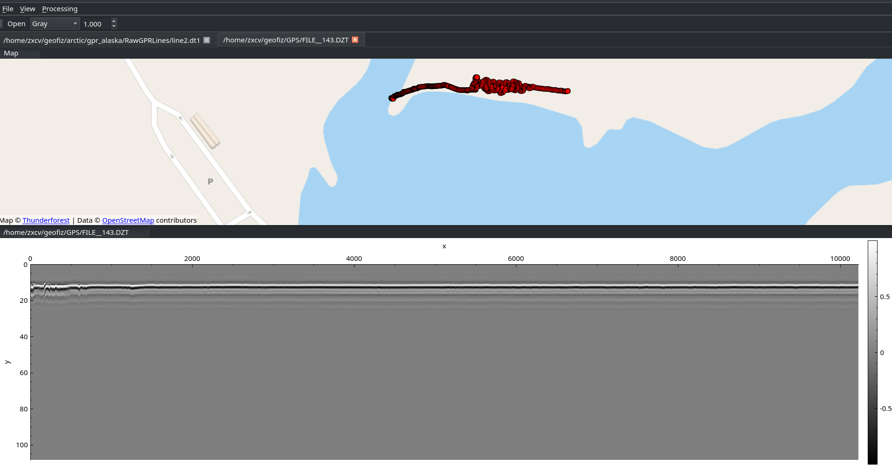
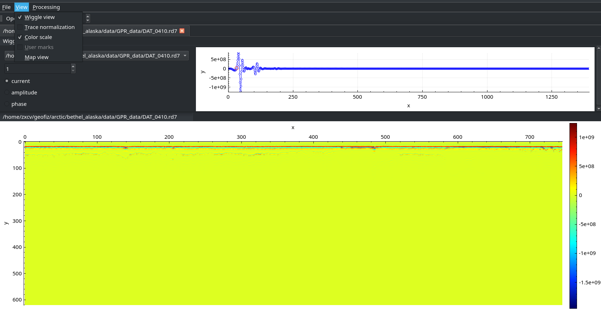
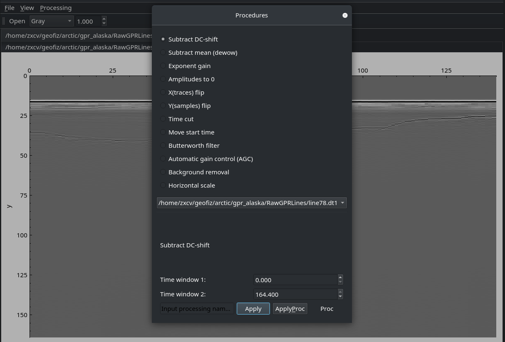

# GPRProc

GPRProc is a C++ application for visualizing and processing Ground Penetrating Radar (GPR) data. The program supports multiple file formats, allows simultaneous operation on several datasets, and provides a range of built‑in signal‑processing tools.

## 📸 Program Preview

Below are example screenshots of the application interface:


---

---


---

## 📂 Supported File Formats

GPRProc can load and visualize data from the following GPR systems:

* **MALA**: `.rd3`, `.rd7`
* **GSSI / Geophysical Survey Systems Inc.**: `.dzt`

  * Automatic loading of survey marks from `.dzx`
  * Displaying geographical survey positions from `.dzg`
* **Sensors & Software**: `.dt1`

---

## ⚙️ Features

### **Simultaneous multi‑file handling**

You can load multiple GPR profiles at once and work on them in parallel.

### **Examples of processing algorithms**

* DC subtraction
* Dewow filtering
* Butterworth filter
* Exponential gain
* Automatic Gain Control (AGC)

---

## 🛠️ Dependencies

### **Required (installed separately):**

* **Qt 6** (modules: *Base*, *QtPositioning*, *QtLocation*, *QtSharedTools*)

  * When installing via Qt Online Installer, choose **MinGW build** on Windows.
* **FFTW3** (floating‑point: `fftw3f`)
* **Boost**
* **g++** compiler
* **CMake** and **make**

### **Included in repository:**

* **Qt Advanced Docking System**
* **liquid-dsp** (DSP library)
* **nmea** (NMEA protocol parser)
* **qcustomplot**
* **pugixml** (XML parser)

---

## Building on Linux

```bash
git clone https://github.com/PetermasterPerfect/GPRProc/
cd GPRProc
mkdir build
cd build
cmake ..
make -j32
```

---

## Building on Windows (MinGW)

Building on Windows is slightly more involved and requires manually specifying toolchain and dependency paths.

```bash
cmake .. -G "Unix Makefiles" \
  -DCMAKE_MAKE_PROGRAM=make.exe \
  -DCMAKE_CXX_COMPILER="<compiler_path>/g++.exe" \
  -DQT_DIR="<qt_path>/<version>/mingw_64/lib/cmake/Qt6" \
  -DFFTW3F_INCLUDE_DIR="<fftw_path>" \
  -DFFTW3F_LIBRARY="<fftw_path>/libfftw3f-3.dll" \
  -DBUILD_AUTOTESTS=NO \
  -DBUILD_EXAMPLES=NO \
  -DBUILD_BENCHMARKS=NO \
  -DFIND_FFTW=NO \
  -DBOOST_INCLUDE="<boost_path>"

make -j32
make install
```

### ⚠️ Note

During Windows builds, you may encounter popup errors related to:

```
mingw/lib/bfp-plugins/libdep.a
```

Despite these messages, the binary builds successfully. They can be safely ignored.

---

